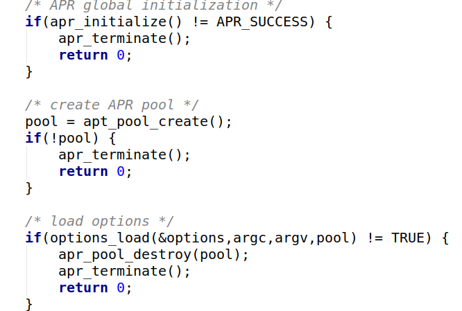

# unimrcp源码阅读

编译就不说了这个官方文档还是能看明白的

unimrcp-version1.6.0

整个项目的目录结构
```
|-- source code
	|-- build/			编译工具
	|-- conf/			配置目录
		|-- unimrcpserver.xml		服务端配置，包括服务ip/端口/asr、tts引擎参数等等
		|-- unimrcpclient.xml		umc配置，包括客户端ip/端口等等
		|-- client-profiles/		umc测试服务配置，每个文件代表一种服务
			|-- unimrcp.xml				默认配置，包括服务ip/端口等等
		|-- umc-scenarios/			umc行为配置
	|-- data/			测试数据
	|-- libs/			基础类库，包括apache runtime/mrcp、sip、rtp协议文本解析等等
	|-- modules/		同上
	|-- platforms/		应用
	|-- plugins/		server端资源插件，支持语音识别/语音合成/录音器/语音认证
	|-- tools/			工具
```

首先我们找到main函数


## 一.启动server加载配置。


首先就是做初始化，创建内存池，加载配置,接下来就是从各种配置文件加载各种东西（目录布局，日志等等）,可以在命令行中制定日志的优先级以及内容的覆盖。


```
static apt_bool_t options_load(server_options_t *options, int argc, const char * const *argv, apr_pool_t *pool)
```
通过root下的几个主要字节点分别进行处理，对应处理函数如下：

unimrcp_server_properties_load ： properties加载

unimrcp_server_components_load ：componets加载，包括各个功能的plugin

unimrcp_server_settings_load ： 

unimrcp_server_profiles_load ：

unimrcp_server_misc_load ：

## 二.消息处理链路

系统启动时会为每个plugin启动一个任务处理线程，循环函数在：


```
apt_consumer_task.c：apt_consumer_task_run()
```
具体消息处理在 ：


```
apt_task.c : apt_task_msg_process()  ——》apt_task_vtable_t.process_msg() ——》会调用到每个plugin定时注册的函数
```
MRCP消息解析 ：


```
apt_text_message.c:apt_message_parser_run()
```
## ASR与TTS实现 

UNIMRCP是MRCP协议的封装，并没有实现ASR或TTS。基于UNIMRCP提供ASR或TTS服务，用户需要自己实现能提供真实ASR和TTS能力的plugin。UNIMRCP提供了ASR和TTS的plugin的demo示例，我们可以基于demo实现自己的plugin。(据我所知目前大家用的都是科大讯飞的或者阿里的)

官方的实现手册

http://www.unimrcp.org/manuals/html/PluginImplementationManual.html


